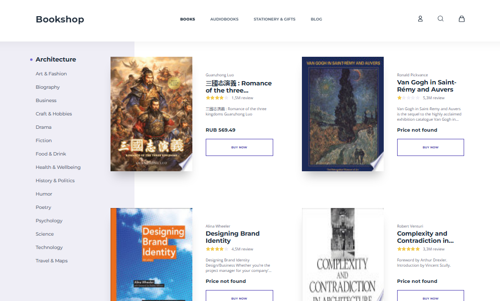

# Google_Books_API

 

### With:
:heavy_check_mark: HTML  
:heavy_check_mark: CSS  
:heavy_check_mark: JS  
:heavy_check_mark: SCSS  
:heavy_check_mark: Webpack  
:heavy_check_mark: Responsive-Design 

### Without:
:x: Libraries 
:x: Frameworks 
:x: Pixel-Perfect 

#### Original layout: *[Figma](https://www.figma.com/design/RJLB6jjmmj3jUMQK9p4T1S/bookshop-(Copy)?m=auto&t=w7EfRhl4ISjroPWk-1)*
